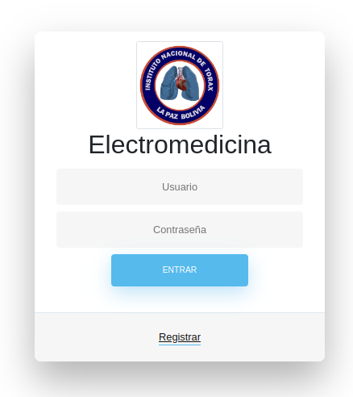

# Maintenance-and-monitoring-of-medical-equipment

Este proyecto se centra en la automatización del programado de fechas para mantenimientos de equipos médicos y la gestión de diagnósticos asociados. La aplicación ofrece una solución integral para facilitar la planificación eficiente de los mantenimientos preventivos, asegurando un rendimiento óptimo de los equipos. Además, permite el registro y seguimiento de diagnósticos, contribuyendo así a una gestión efectiva de los recursos médicos, por parte del área de electromedicina.

Herramientas de Desarrollo:

**Frontend:**

- HTML
- CSS
- BOOTSTRAP
- JAVASCRIP
- AJAX

**Backend:**

- PHP
- MYSQL

## Configuración y Uso

Para poner en marcha la aplicación:

1. Asegurate de tener instalado xampp en tu sistema.

2. Creacion de la base de datos

 

3.  Copiar y pegar todo el contenido de la carpeta "bd/electromedicina.sql" 
      

4.  Mediante una consulta sql, pegar el contenido y aceptar 
      

        4.1. Vista de las tablas creadas 

      

5.  Una vez esto iniciar sesion mediante el enlace: "http://localhost:8080/electromedicina/index.php" 
      

6.  Registrarse y elegir la opcion de "administrador", este formulario de registro solo se mostrara una vez. 
      

7.  Se mostrara la pagina principal de la aplicacion web en donde se puede enpezar a navegar y ver las distintas opciones. 
     
