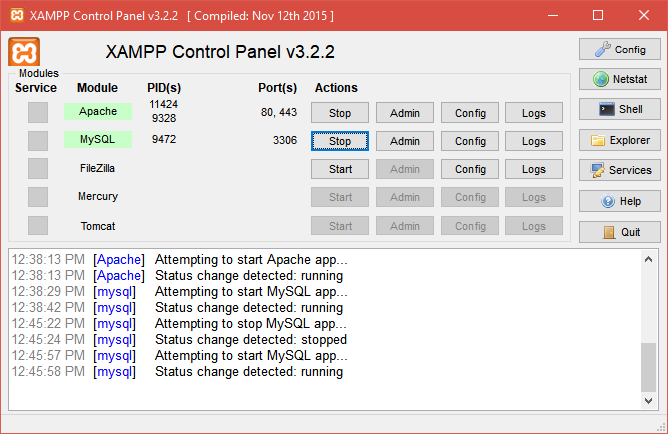

# Maintenance-and-monitoring-of-medical-equipment

Este proyecto se centra en la automatización del programado de fechas para mantenimientos de equipos médicos y la gestión de diagnósticos asociados. La aplicación ofrece una solución integral para facilitar la planificación eficiente de los mantenimientos preventivos, asegurando un rendimiento óptimo de los equipos. Además, permite el registro y seguimiento de diagnósticos, contribuyendo así a una gestión efectiva de los recursos médicos, por parte del área de electromedicina.

Herramientas de Desarrollo:

**Frontend:**

- HTML
- CSS
- BOOTSTRAP
- JAVASCRIP
- AJAX

**Backend:**

- PHP
- MYSQL

## Configuración y Uso

Para poner en marcha la aplicación:

1. Asegurate de tener instalado xampp en tu sistema.

¿Como poner en marcha el proyecto?
1.1 Dar de alta a xampp 

    LINUX
    para iniciar => sudo /opt/lampp/lampp start
    para detener => sudo /opt/lampp/lampp stop

  

    WINDOWS

  

2. Creacion de la base de datos

 

    2.1 Modelo Entidad Relacion

 

3.  Copiar y pegar todo el contenido de la carpeta "bd/electromedicina.sql" 
      

4.  Mediante una consulta sql, pegar el contenido y aceptar 
      

        4.1. Vista de las tablas creadas

      

5.  Una vez esto iniciar sesion mediante el enlace: "http://localhost:8080/electromedicina/index.php" 
      

6.  Registrarse y elegir la opcion de "administrador", este formulario de registro solo se mostrara una vez. 
      

7.  El primer usuario siempre sera registrado como administrador teniendo total acceso y solo el puede agregar nuevos usuarios.

8.  Se cuenta con 3 vistas una para los usuarios.
    La vista administradores, los cuales pueden hacer todas las acciones permitidas.
    La vista estandar solo puede visualizar y consultar datos, asi como un acceso para poder realizar el mantenimiento programado y adjuntar a este su informe y fotos si es necesario.
    LA vista de invitado, el cual solo puede ver la lista de mantenimientos realizados y ase hacer control de estos equipos.

UNIDAD  
  
ENCARGADO  
  
USUARIO  
  
ESTADO  
  
EQUIPO  
  
TIPO DE MANTENIMIENTO  
  
ASIGNAR MANTENIMIENTO  
  
EDITAR DATOS  
  
HOME muestra el listado de mantenimientos pendientes y solo adminsitradores y usuarios estandar pueden pasar a completarlo  
  
  

Programando un mantenimiento 
Asignar mantenimiento 
  
Registro de mantenimientos realizados, vista admin  
  

Registro de mantenimientos realizados, vista standar  
  

ASISTENCIA: Esta vista solo aparece para los usuarios que tengan asignado el nivel standar  
  
LLENANDO ASISTENCIA  
  

Vista con opciones de usuario standar  
  

Vista de archivos en tiempo real  
  
  

Vista de archivos descargados y por usuario  
  
  

